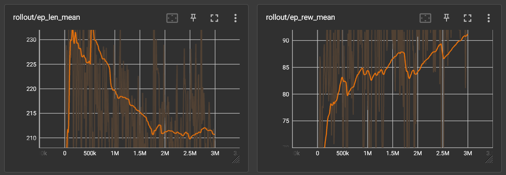

# 贪吃蛇环境

## 安装

```bash
# linux
bash build.sh
# window
./build.bat
```

## 使用
```python
from stable_baselines3.common.env_util import make_vec_env

envs = make_vec_env("tcs-v2", env_kwargs={
        "height": 8, # 高
        "width": 8,  # 宽
        "render_mode": "human", # 是否渲染
        "mp4": True, # 是否录制 mp4
        "image_size": 15, # 训练图片，单个方框大小
    }, n_envs=1,
        seed=1, # 随机食物种子
    )
```

## 训练曲线图



## 演示


## 加载模型

```python
from stable_baselines3.common.env_util import make_vec_env
from stable_baselines3 import *


envs = make_vec_env("tcs-v2", env_kwargs={
    "height": 8,
    "width": 8,
    "render_mode": "human",
    "mp4": True,
    "image_size": 15,
    "mp4fps": 30,
}, n_envs=1,
    seed=999,
)

model = PPO.load("./model/v6.zip", envs)
```

